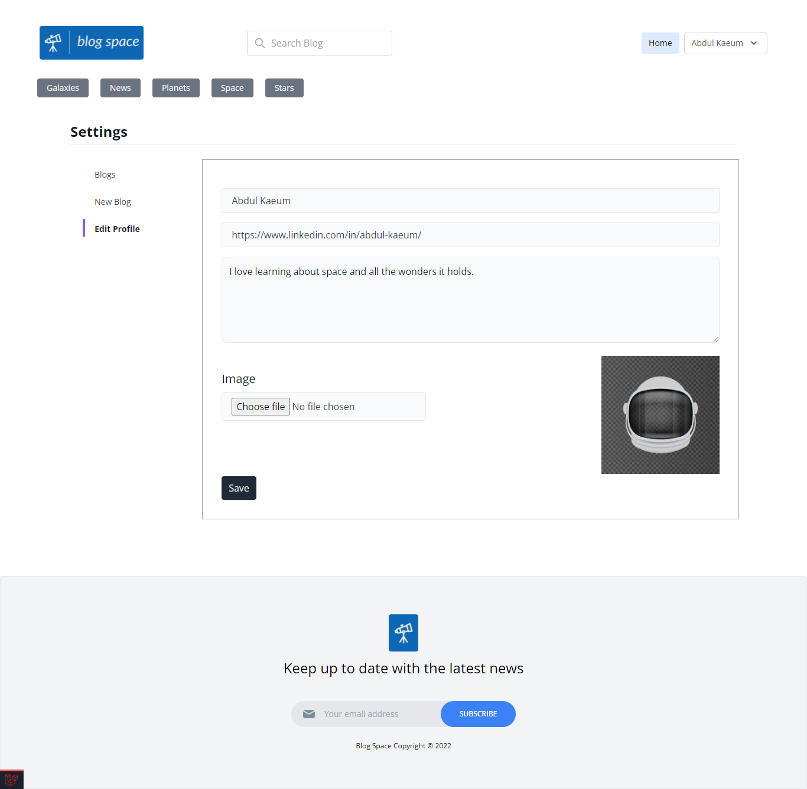

### My Space Blog

I always wanted to learn about space and astronomy, so I thought why not start with creating a blog.

#### Features

- Register and login including username
- View blog without registering
- Show a single post
- Search posts via post title, body, author or category
- Load all posts via a single category
- Subscribe to newsletter and capture email to Mailchimp service
- Record post views count
- Attach a post to multiple categories
- View a profile
- Edit a profile to include url, about section and upload avatar
- Follow and unfollow authors
- Rate posts
- Bookmark posts
- Display all bookmarks associated to a user
- Show random related posts
- Submit a comment on a post
- View all post comments
- Mark comments as best comment
- Display count of followers, following and posts
- User roles admin and basic level
- Admin panel
  - view all posts
  - Delete posts
  - Publish (set live) posts
  - Create posts, upload image, associate multiple categories and set the author
  - Edit a post

#### Screenshots
- Home

- Register

- Login

- Admin view all posts

- Create a new post

- Edit a post

- Single post

- Profile

- Profile edit

- Subscribe to newsletter

- Subscription service uses Mailchimp

